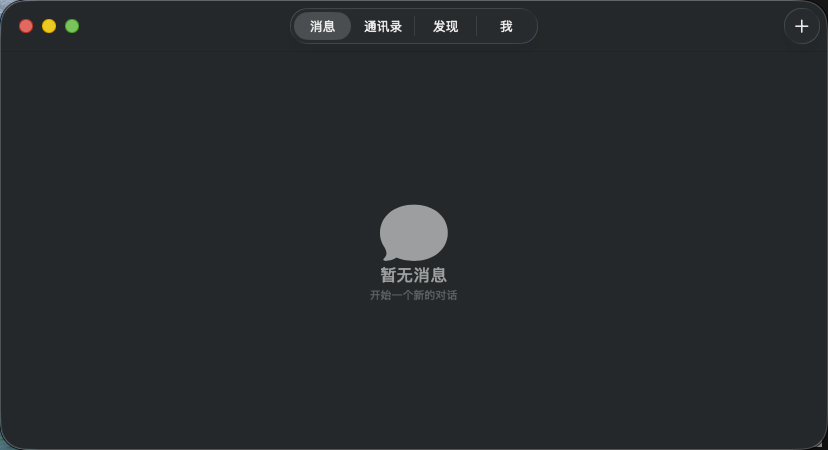
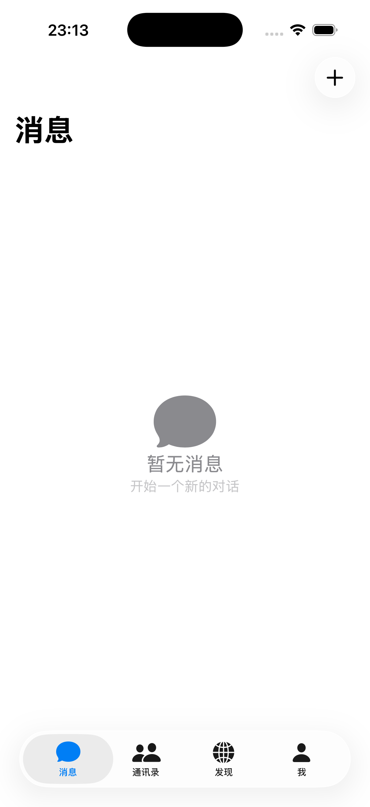
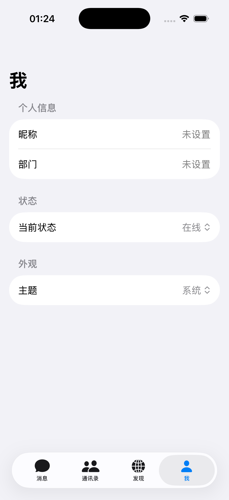
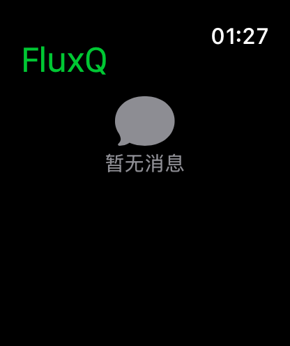

# FluxQ

<div align="center">

**跨平台局域网即时通讯应用**

使用 Swift 和 SwiftUI 开发,支持 Apple 全平台

[]()
[]()
[]()

[功能](#功能) • [安装](#安装) • [使用](#使用) • [构建](#构建) • [路线图](#路线图)

</div>

---

## 项目概述

FluxQ 是一款完全复刻飞秋(FeiQ)功能的跨平台即时通讯应用,支持 IPMsg 和飞鸽协议,在 Apple 全平台(macOS、iOS、iPadOS、watchOS)上运行。UI 设计借鉴 WeChat 的核心布局,同时使用 Apple 原生组件保持平台一致性。

### 核心特性

- 🌐 **局域网即时通讯**: 无需服务器,P2P 通信
- 💬 **一对一聊天**: 实时文本消息
- 👥 **群聊**: 多人群组聊天
- 📁 **文件传输**: 支持文件和文件夹传输,断点续传
- 📸 **截图与图片**: 捕获屏幕截图并在聊天中分享
- 🔒 **端到端加密**: 可选的消息加密
- 🔍 **消息搜索**: 跨所有会话的全文搜索
- 🎨 **现代 UI**: 借鉴 WeChat,使用 SwiftUI 原生组件

### 技术栈

| 层级 | 技术 |
|------|------|
| UI 框架 | SwiftUI |
| 数据持久化 | SwiftData + CloudKit |
| 网络层 | Network.framework + BSD Socket |
| 状态管理 | @Observable |
| 并发 | Swift Concurrency |
| 协议 | IPMsg (端口 2425) |

## 系统要求

| 平台 | 最低版本 |
|------|---------|
| macOS | 14 (Sonoma) |
| iOS | 17 |
| iPadOS | 17 |
| watchOS | 10 |

## 功能

### v0.1.0 - 基础框架 ✅ (已完成)

- ✅ **Xcode 多平台项目**: macOS 14+, iOS 17+, watchOS 10+
- ✅ **SwiftData 数据模型**: User, Message, Conversation
- ✅ **主界面 TabView**: 消息、通讯录、发现、我（4 个 tabs）
- ✅ **主题系统**: 浅色/深色/系统主题切换
- ✅ **watchOS 基础界面**: MessageListView

### v0.2.0 - 网络通信 🚧 (开发中)

- 🚧 **IPMsg 协议**: UDP 广播 + TCP 消息
- 🚧 **用户发现**: 局域网自动发现
- 🚧 **消息收发**: 实时文本消息

### 未来版本

详见 [路线图](docs/plans/roadmap.md)。

## 安装

### 当前状态

**v0.1.0 开发版**：基础框架已完成，可运行查看 UI 界面。网络通信功能正在开发中（v0.2.0）。

### 从源码构建

```bash
# 克隆项目
git clone git@github.com:martinadamsdev/FluxQ.git
cd FluxQ

# 打开 Xcode 项目
open FluxQ.xcodeproj

# 在 Xcode 中选择 target 和目标设备,然后构建运行 (⌘R)
```

详细构建说明见 [BUILD.md](docs/BUILD.md)。

### 发布版本

发布版本将在 v1.0.0 发布后提供:

- macOS: DMG 安装包
- iOS/iPadOS: TestFlight / App Store
- watchOS: 通过 iOS 应用自动安装

## 界面预览

### macOS


### iOS



### watchOS


> 注：截图为 v0.1.0 基础框架，网络通信功能将在 v0.2.0 中实现。

## 使用

### 快速开始

1. **启动应用** - 首次启动会自动发现局域网用户
2. **设置资料** - 在"我"标签设置昵称和部门
3. **开始聊天** - 在"发现"标签点击用户开始聊天

### 主要功能

#### 发现用户

- 应用自动通过 UDP 广播发现局域网用户
- 在"发现"标签查看在线用户
- 下拉刷新手动触发重新发现

#### 发送消息

- 点击用户进入聊天界面
- 输入消息并点击发送按钮
- 支持表情、图片、文件

#### 文件传输

- 点击聊天界面的"+"按钮
- 选择文件或文件夹
- 接收方确认后开始传输

#### 群聊

- 在消息列表点击右上角"+"
- 选择成员创建群组
- 所有成员可以发送和接收群组消息

详细使用说明见 [用户指南](docs/USER_GUIDE.md)。

## 构建

### 要求

- Xcode 15.0+
- macOS 14.0+
- Swift 5.9+

### 步骤

```bash
# 克隆项目
git clone git@github.com:martinadamsdev/FluxQ.git
cd FluxQ

# 运行测试
swift test

# 构建 macOS 应用
xcodebuild -workspace FluxQ.xcworkspace \
           -scheme FluxQ \
           -destination 'platform=macOS' \
           build

# 构建 iOS 应用
xcodebuild -workspace FluxQ.xcworkspace \
           -scheme FluxQ \
           -destination 'platform=iOS Simulator,name=iPhone 15 Pro' \
           build
```

详见 [BUILD.md](docs/BUILD.md)。

## 项目结构

```
FluxQ/
├── App/                        # 应用层
│   ├── FluxQ/                 # macOS/iOS/iPadOS 应用
│   └── FluxQWatch/            # watchOS 应用
├── Modules/                    # 本地 Swift Packages
│   ├── IPMsgProtocol/         # IPMsg 协议实现
│   ├── FluxQModels/           # SwiftData 数据模型
│   ├── FluxQServices/         # 业务服务层
│   └── FluxQUI/               # 共享 UI 组件
├── Tests/                      # 测试
└── docs/                       # 文档
    ├── plans/                  # 版本迭代计划
    ├── ipmsg.md               # IPMsg 协议分析
    └── BUILD.md               # 构建指南
```

## 路线图

### v1.0.0 - 局域网即时通讯 ✅

完整的飞秋功能,支持 Apple 全平台。

**进度**: v0.1.0 → v1.0.0 (10 个版本)

详见 [路线图](docs/plans/roadmap.md) 和各版本计划文档。

### v2.0.0 - OpenClaw AI 集成

连接 OpenClaw AI 助手平台。

### v3.0.0 - 多 LLM 聊天机器人

可插拔的 LLM 架构(Ollama/Claude/GPT/中国 LLM)。

### v4.0.0 - 云端即时通讯

混合 LAN/Server 模式,支持跨网络通信。

## 协议

FluxQ 实现 IPMsg (IP Messenger) 协议:

- **端口**: UDP/TCP 2425
- **协议版本**: v1 和 v3
- **兼容性**: 与飞秋、飞鸽互操作

详见 [IPMsg 协议分析](docs/ipmsg.md)。

## 贡献

欢迎贡献!请阅读 [贡献指南](CONTRIBUTING.md) 了解如何:

- 报告 bug
- 提出功能建议
- 提交 Pull Request

## 许可证

FluxQ 采用 MIT 许可证。详见 [LICENSE](LICENSE) 文件。

## 致谢

- [IP Messenger](https://github.com/shirouzu/ipmsg) - 原始 IPMsg 协议实现
- [Sky Flux IM](https://github.com/sky_flux_im) - 项目灵感和参考设计
- [飞秋(FeiQ)](http://www.feiq18.com/) - 中文本地化版本

## 联系方式

- **作者**: Martin Adams
- **邮箱**: martinadamsdev@gmail.com
- **GitHub**: [martinadamsdev/FluxQ](https://github.com/martinadamsdev/FluxQ)

---

<div align="center">

**如果这个项目对你有帮助,请给一个 ⭐️**

Made with ❤️ using Swift and SwiftUI

</div>
